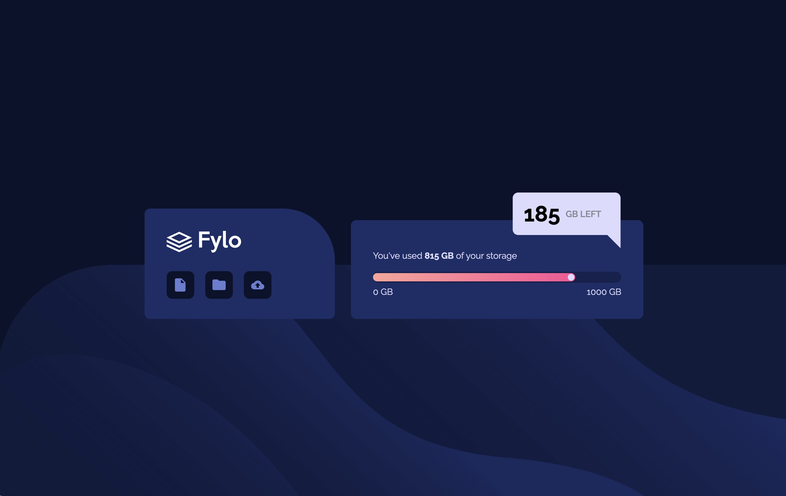

# Fylo Data Storage Component

Essa é uma solução para o [Desafio: "Fylo Data Storage Component" do Frontend Mentor](https://www.frontendmentor.io/challenges/fylo-data-storage-component-1dZPRbV5n). Os desafios que esse site oferece ajuda desenvolvedores a melhorar suas habilidades de código!

## O Desafio

### Requisitos

Usuários devem poder ver:

- O layout ideal para o conteúdo dependendo do tamanho da tela do dispositivo

## Tecnologias Utilizadas

- HTML

- CSS

## Aprendizado

- Aprendi a fazer uma progress bar.

```html
<div class="bar">
    <div class="usage-bar">
        <div class="bar-point"></div>
    </div>
</div>
```

```css
main .container .storage .card .progress .bar {
    width: 450px;
    height: 20px;
    background-color: hsl(229, 57%, 11%, 0.4);
    border-radius: 20px;
}
main .container .storage .card .progress .bar .usage-bar {
    background: linear-gradient(to right, hsl(6, 100%, 80%), hsl(335, 100%, 65%));
    width: 81.5%;
}
main .container .storage .card .progress .bar .usage-bar .bar-point {
    width: 12px;
    height: 12px;
    background-color: hsl(243, 100%, 93%);
    border-radius: 50%;
}
```

- Aprendi a usar bordas transparentes a fim de mudar o formato do elemento (visivelmente)

```css
main .container .storage .storage-left::after {
    content: "";
    position: relative;
    bottom: -50px;
    width: 0;
    height: 0;
    border-right: 25px solid transparent;
    border-top: 25px solid hsl(243, 100%, 93%);
    transform: rotate(90deg);
}
```

- Pratiquei o uso do position relative e suas propriedades, principalmente o transform, de maneira que fique responsivo.

```css
main .container .storage .storage-left {
        position: relative;
        left: 50%;
        transform: translate(-50%, 320%);
}
```

## Preview

### Desktop



### Mobile


